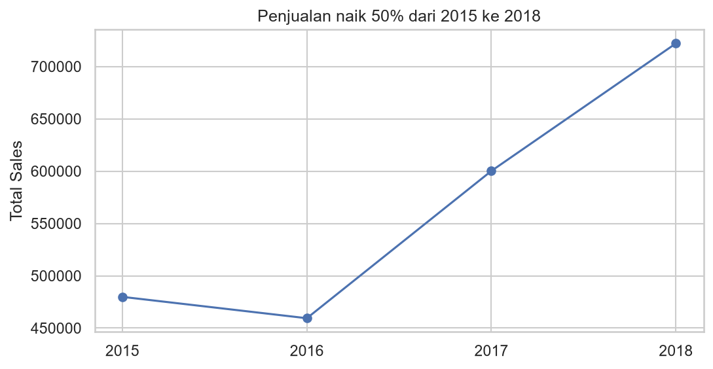
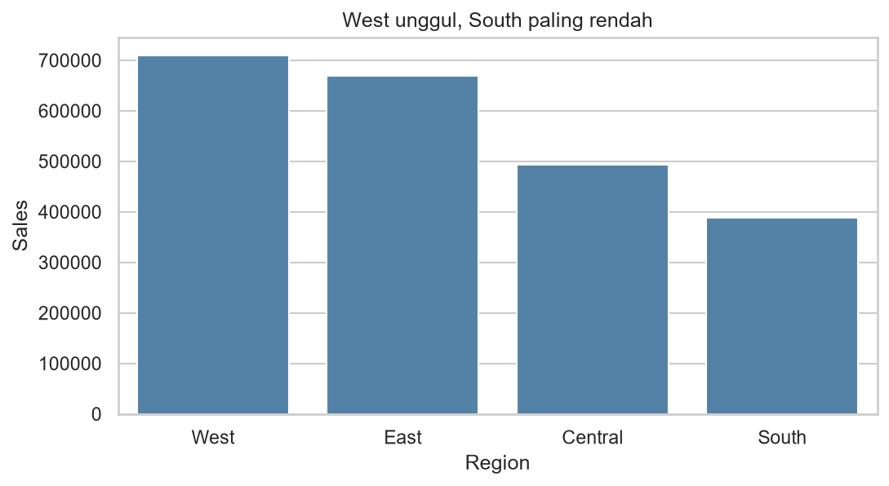
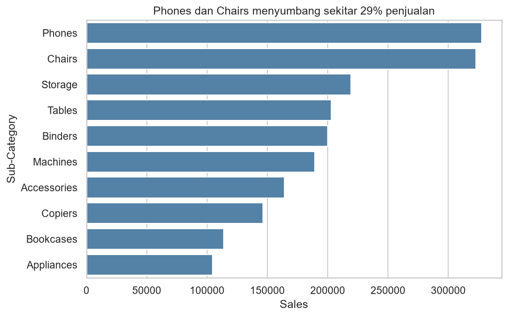

# Analisis Penjualan Retail

Analisis 9.800 transaksi retail (2015-2018) untuk mengetahui kategori, wilayah, dan tren penjualan terkuat. Hasil utama: penjualan naik sekitar 50% dari 2015 ke 2018, dengan Phones dan Chairs sebagai penyumbang terbesar.

## Pertanyaan Bisnis
1. Kategori dan sub-kategori mana yang paling banyak terjual?
2. Wilayah mana yang paling kuat dan paling lemah?
3. Bagaimana tren penjualan per tahun?

## Dataset
Superstore Sales (Kaggle), 9.800 baris, 18 kolom. Kolom utama: Order Date, Category, Sub-Category, Region, Sales.

## Proses
- Mengubah Order Date dan Ship Date menjadi tipe tanggal (format hari/bulan/tahun).
- Membuat kolom Tahun dan Bulan.
- Postal Code kosong di 11 baris; dibiarkan karena tidak dipakai dalam analisis.
- Tidak ditemukan baris duplikat. (sesuaikan dengan hasil df.duplicated().sum())

## Temuan Utama
1. Technology kategori terbesar (sekitar 37%), disusul Furniture (32%) dan Office Supplies (31%).
2. Phones dan Chairs menyumbang sekitar 29% total penjualan.
3. West tertinggi, South terendah (sekitar 55% dari West).
4. Penjualan turun 4% di 2016, lalu naik 31% (2017) dan 20% (2018).

## Rekomendasi
1. Prioritaskan stok dan promosi untuk Phones dan Chairs.
2. Selidiki penyebab rendahnya penjualan di South.
3. Tambahkan data profit agar analisis bisa menilai keuntungan, bukan hanya penjualan.

## Tools
Python, pandas, matplotlib, seaborn, VS Code.